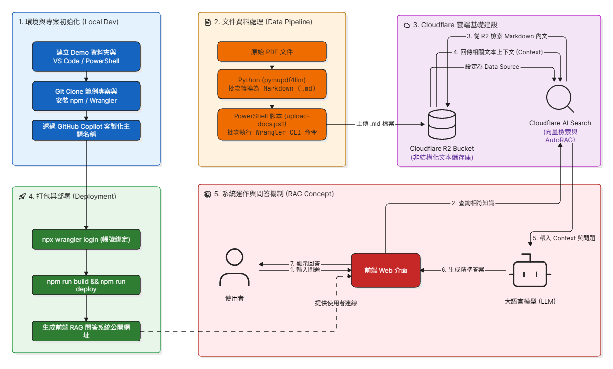

# 📚 如何建置 RAG 機器人 — 實習學習筆記

醫院實習期間整理的 RAG（檢索增強生成）聊天機器人建置指南，記錄從零開始學習、設計與搭建 RAG 系統的過程，供之後回顧與交接使用。

> 本專案為醫院實習學習筆記，僅供學習與作品展示使用。

## 內容

- **[RAG建置說明書_最終版.docx](./RAG建置說明書_最終版.docx)** — 完整建置說明書，含架構設計、實作步驟與注意事項
- **[與AI溝通範例.pptx](./與AI溝通範例.pptx)** — 與 AI 協作開發過程中，如何下 prompt / 溝通需求的範例整理
- **[RAG_architecture_diagram.png](./RAG_architecture_diagram.png)** — RAG 系統架構圖

## 輔助腳本

- `convert_md_to_docx.py` — 將 Markdown 筆記轉換成 Word 說明書格式
- `create_presentation.py` — 用程式產生簡報（`.pptx`），將學習過程整理成投影片

## 這份筆記如何被用到

這份文件記錄的方法論，後續實際應用在同一實習期間開發的幾個 RAG 聊天機器人上：

- [病歷申請查詢機器人](../medical-records-room-bot)
- [感官衛教海報問答機器人](../sensory-care-poster-bot)
- [頭頸癌衛教影片問答機器人](../targeted-therapy-video-bot)
- [PubMed BigQuery 醫學問答機器人](../pubmed-thesis-search-bot)
